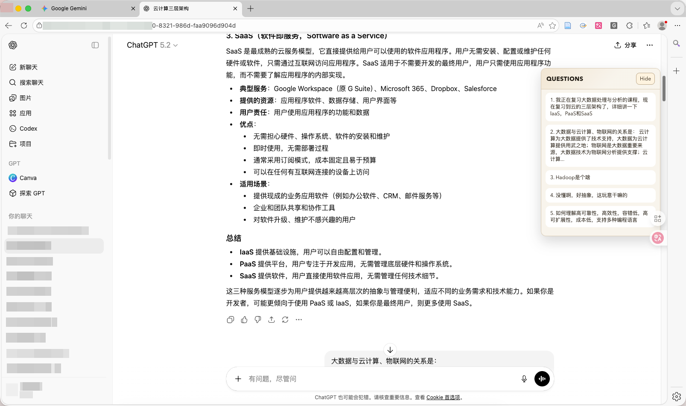
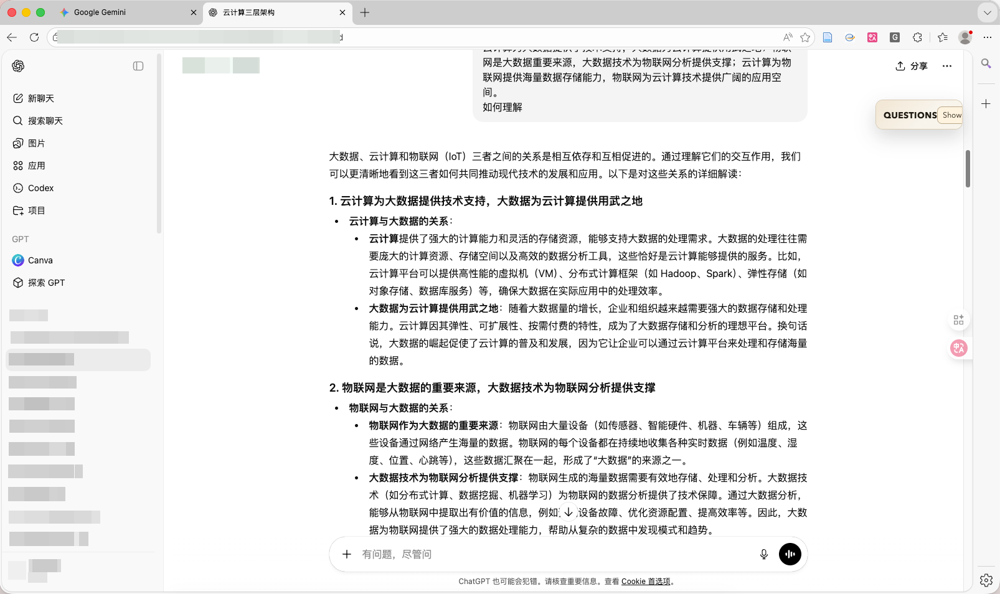

# GPT Question Navigator

一个轻量级的浏览器扩展，用于在 ChatGPT / Gemini / 豆包 的长对话中**快速导航用户提问（User Prompts）**。

A lightweight browser extension that helps you quickly navigate **user questions (prompts)** in long ChatGPT / Gemini / doubao conversations.

---

## ✨ Features | 功能特性

- 自动提取当前对话中的所有用户提问，并生成编号列表  
  Automatically extracts all user prompts in the current conversation
  and displays them as a numbered list

- 点击列表项即可跳转到对应消息，并进行高亮提示  
  Click to jump to the corresponding message with visual highlighting

- 新消息出现时自动更新，无需刷新页面  
  Automatically updates when new messages appear

- 轻量、无配置、即装即用  
  Lightweight, no configuration required

- 可点击面板上侧拖动位置，并根据需要调整宽度与高度  
  Draggable panel with adjustable width and height

---

## 🖥 Supported Websites | 支持的网站

- https://chatgpt.com/*
- https://gemini.google.com/*
- https://*.doubao.com/*
- https://chat.deepseek.com/*

---

## 🖼 Screenshots | 效果图

### Expanded Panel | 展开状态

右侧面板展开，显示完整的用户问题列表  
Right-side panel expanded, showing the full list of user questions

### Collapsed Panel | 折叠状态

面板折叠以节省屏幕空间  
Panel collapsed to save screen space

---

## 📦 Installation (Unpacked) | 安装方式（解压安装）

1. 打开 Chrome 或 Edge，访问管理扩展。  
   Open Chrome or Edge and go to:  
   `chrome://extensions`

2. 启用 **Developer mode（开发者模式）**

3. 点击。**Load unpacked（加载已解压的扩展程序）**

4. 选择本项目下的 **GPT Question Navigator** 文件夹。  
   Select the project folder-**GPT Question Navigator**

---

## 📁 Project Structure | 项目结构

- `manifest.json`  
  扩展清单文件（Manifest V3）  
  Extension manifest (MV3)

- `content.js`  
  内容脚本，负责：
  - 扫描用户提问
  - 构建并更新右侧导航面板  
  Content script that scans prompts and builds the navigation panel

- `styles.css`  
  面板及高亮样式  
  Styles for the panel and highlight effects

---

## 🛠 Development | 开发说明

- 直接编辑源码文件  
  Edit the source files directly

- 修改后在扩展管理页面点击“重新加载”即可生效  
  Reload the extension from the extensions page after changes

- 无需构建步骤  
  No build step required

---

